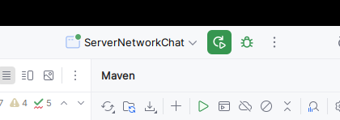

# Сетевой чат

## Информация о проекте

Для реализации сетевого чата была придумана следующая архитектура

1) Клиент подключается к серверу через Network Socket, далее ему необходимо авторизоваться, придумать себе ник.
2) На смехе это `ala`
3) После чего клиент получает сообщение, что авторизация прошла успешно, и все участники чата получают сообщение, что к нам подключилась `ala`
4) Далее он становиться полноценным участником чата и может слать сообщения!
5) По логики, все участники чата получают сообщения, кроме отправителя!

Получается у нас сервер-клиент приложение, настройки задаются с помощью файла [`settings.file`](./settings.file)
Пример данных настроек
```editorconfig
server.port=8080
server.host=192.168.8.74
server.backlog=500
server.path.logger=/tmp/server.log
```
Данные параметры читаются модулем `app-configure`, в данном модуле написан пакет configureApp 
и соответсвующий класс `ConfigureApp`, который полностью парсит данный конфиг, так же в модуле сервер и клиент
добавлен код, который использует данный модуль, и получает стандартные настройки.

Сервер может запуститься с дефолтными настройками!, клиент нет.

Так же сделан отдельный модуль логирования, который используется и на стороне 
сервера и на стороне клиента.
Саму реализацию [можно посмотреть самостоятельно](src/main/java/ru/netology/logger/Logger.java)

### Реализация Сервера

Как ране говорилось, сервер парсит стандартный конфиг файл и запускается с этими настройками.
Для проверки запуска можно использовать такие утилиты как `ss -tulpn | grep PORT`

```bash

 ss -tulpn | grep 8080
tcp   LISTEN 0      500                  [::ffff:192.168.8.74]:8080             *:*    users:(("java",pid=438249,fd=6))   
```
Так же можно использовать телнет, даже как полноценный клиент
```bash
telnet 192.168.8.74 8080
Trying 192.168.8.74...
Connected to 192.168.8.74.
Escape character is '^]'.
[AUTH] Введите ваше имя: 
mikl
[AUTH] Успешно! Добро пожаловать, mikl!

```
Основной класс который реализует запуск сервера, это `ServerNetworkChat` тут происходит несколько важных операция,
1) Парсинг настроечного файла
2) Создание сокета для общения с клиентами
3) Так же реализованы доп методы, такие как удаление пользователя и массовая отправка
Далее передаем управление в подкласс `UserChat` который наследует свойства и методы класса `Thread`
Тут происходит прослушивание сокета, авторизация новых пользователей, отправка сообщений
Отдельно вынесен класс авторизации, так как он требовал более детального контроля. Что-бы не авторизованные пользователя могли получать сообщения, прежде чем
они представятся.

### Реализация Клиента

Клиент не может работать без сервера, поэтому тут нет дефолтных настроек по умолчанию.
Основной класс это `ClientNetworkChat` который запускает несколько задач
1) Парсит настроечный конфиг файл.
2) Отправляет сообщения который пользователь подготовил.
3) Открывает новый сокет для общения с сервером.
4) Прослушивание сервера реализованно в многопоточном режиме `public class ClientSession extends Thread`


## Сборка проекта

*!!Важно*
<br>
Проект тестировался и проверялся на Linux debian 12 
* Остальные ОС не тестировались!
java version 11
</br>

1) проект можно запустить из IDEA,
  - запускаем сначала сервер



Отследить состояние можно по лог файлы. там детальный лог на каждое действие пользователей
```bash
2025-06-13T13:19:31.137 [INFO] - Конфиг файл найден
2025-06-13T13:19:31.137 [INFO] - [INFO] Новое подключение
[INFO] IP: /192.168.8.74
2025-06-13T13:19:31.137 [INFO] - Новый поток для пользователя с IP: /192.168.8.74
2025-06-13T13:19:31.137 [INFO] - [AUTH] Успешно! mikl
2025-06-13T13:19:31.137 [INFO] - Пользователь mikl авторизовался.
2025-06-13T13:19:31.137 [INFO] - К нам присоединился mikl
```
* Вывода в консоль не будет, требуется открыть лог файл, для отслеживания состояния сервера. `tail -f  /tmp/server.log`
  - Далее запускаем клиента
  - 


 в нижнем окне будет приглашение для авторизации
```bash
Логирование будет произведено в файл /tmp/client-fb8bf97e Можно открыть в терминале `tail -f /tmp/client-fb8bf97e` 
[AUTH] Введите ваше имя: 
| 
```
2) Собрать исходники так же можно через IDEA
2.1) Сначала собираем весь проект полностью через IDEA Maven 


Сначала требуется нажать и дождаться результата
- clean
- package
2.2) Можно запускать сервер, необходимо перейти в каталог с проектом, либо вынести jar файлы в необходимое место
```bash
java -cp "logger/target/logger-1.0-SNAPSHOT.jar:server/target/server-1.0-SNAPSHOT.jar:app-configuration/target/app-configuration-1.0-SNAPSHOT.jar" ru.netology.ServerNetworkChat
```
* Вывода в консоль не будет, требуется открыть лог файл, для отслеживания состояния сервера. `tail -f  /tmp/server.log`

3.1) Запускаем клиента
```bash
java -cp "logger/target/logger-1.0-SNAPSHOT.jar:client/target/client-1.0-SNAPSHOT.jar:app-configuration/target/app-configuration-1.0-SNAPSHOT.jar" ru.netology.ClientNetworkChat
```

